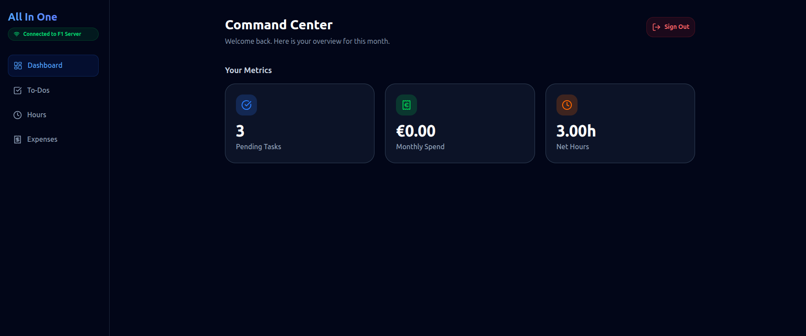
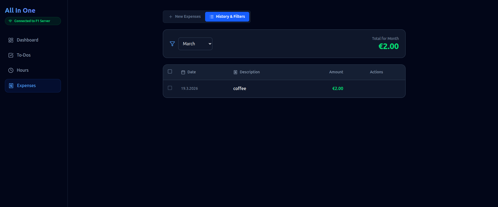
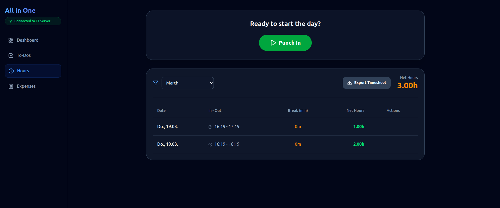
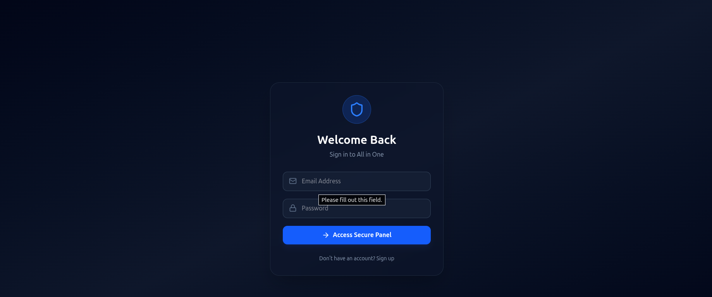
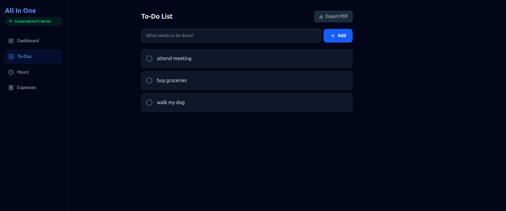
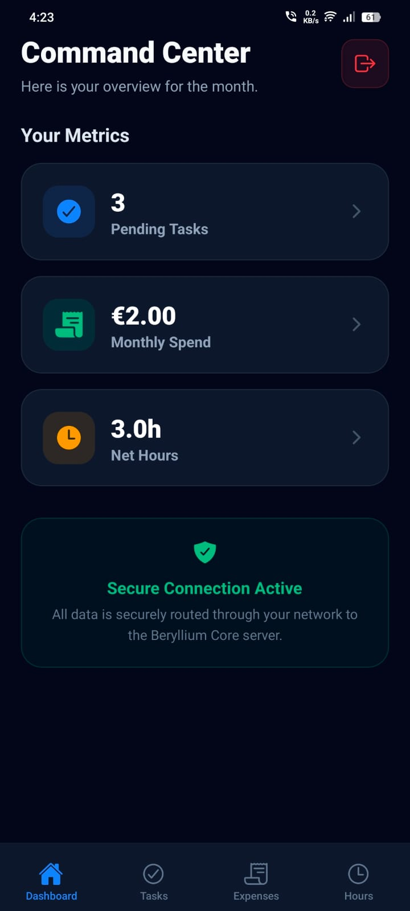
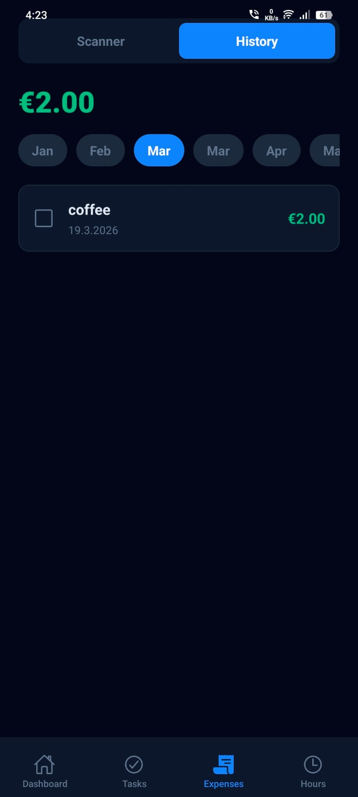
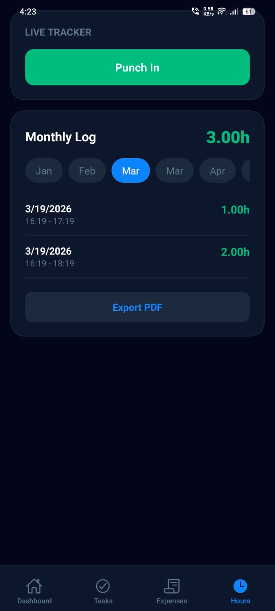
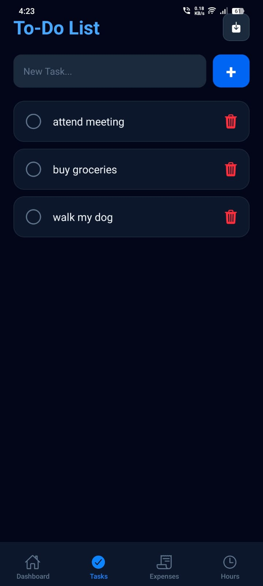

# 🚀 Beryllium Core (All-In-One)

Welcome to Beryllium Core. This isn't just a standard web app; it is a full-stack, hardware-accelerated personal app designed to track daily life metrics. 

Built as a **Monorepo**, this project houses a Web Dashboard, a React Native Mobile App, and a Node.js Backend API. The most unique part of this architecture? **The production database and backend server are running natively on a repurposed Poco F1 Android smartphone** running postmarketOS **Linux based system**, sitting on a Home Wi-Fi network, and securely tunneled to the public internet.

---

## 🔗 Live Links
* **Web Dashboard:** [[Link](https://all-in-one-sage.vercel.app/)]
* **Mobile App (.apk):** [📥 Download the Android APK Here] (https://github.com/suberkhazi/AllInOne/releases/download/v1.0.0/All.In.One.apk)

## 📱 Installation Note (Android)

Because this app is a custom build and not currently hosted on the Google Play Store, Android will flag it as an "Unknown App." This is standard security behavior. To install:

1. **Download the APK:** Click the link in the "Mobile App" section above.
2. **Open the File:** Once downloaded, tap the notification or find it in your "Downloads" folder.
3. **Allow Settings:** If prompted, toggle the switch to "Allow installation from this source."
4. **Bypass Play Protect:** If a "Blocked by Play Protect" warning appears, click **"Install Anyway"** (do not just click "OK").
5. **Launch:** The All in One icon will now appear on your home screen!
---

## ✨ Core Features & Functionality

All in one is split into four primary modules, seamlessly synced between your phone and your laptop:

### 1. 📊 The Dashboard
* **Overview:** A high-level telemetry screen summarizing your life metrics. 
* **Web View:** Features a wider, analytics-focused layout to review monthly progress at a glance.

### 2. ✅ Task Management (Todos)
* **Functionality:** Create, edit, and complete daily tasks. 
* **Sync:** Checking off a task on the mobile app instantly updates the web dashboard via the central backend.

### 3. 💸 Expense Tracker & AI Scanner
* **Functionality:** Track daily spending and categorize expenses.
* **AI OCR Integration:** Instead of manually typing out receipts, the mobile app utilizes an AI-powered Optical Character Recognition (OCR) scanner to read receipts through your phone's camera and automatically log the expense amounts (Not optimized yet uses Teserect).

### 4. ⏳ Hours & Time Tracking
* **Functionality:** Log hours worked, study sessions, or project time to keep yourself accountable and measure productivity over time.


## 📸 App Preview

### 🌐 Web Dashboard (Desktop)
<table style="width: 100%;">
  <tr>
    <th style="text-align: center; width: 33%;">Dashboard</th>
    <th style="text-align: center; width: 33%;">Expenses</th>
    <th style="text-align: center; width: 33%;">Hours Tracking</th>
  </tr>
  <tr>
    <td style="vertical-align: top;"></td>
    <td style="vertical-align: top;"></td>
    <td style="vertical-align: top;"></td>
  </tr>
  <tr>
    <th style="text-align: center;">Login Interface</th>
    <th style="text-align: center;">Todo</th>
    <th></th>
  </tr>
  <tr>
    <td style="vertical-align: top;"></td>
    <td style="vertical-align: top;"></td>
    <td></td>
  </tr>
</table>

---

### 📱 Mobile Interface
<table style="width: 100%;">
  <tr>
    <th style="text-align: center; width: 25%;">Dashboard</th>
    <th style="text-align: center; width: 25%;">Expenses</th>
    <th style="text-align: center; width: 25%;">Hours</th>
    <th style="text-align: center; width: 25%;">Todos</th>
  </tr>
  <tr>
    <td style="vertical-align: top;"></td>
    <td style="vertical-align: top;"></td>
    <td style="vertical-align: top;"></td>
    <td style="vertical-align: top;"></td>
  </tr>
</table>

---

## 🔐 User Authentication & Security

The app is protected by a custom-built authentication system.

* **Account Creation:** Users can sign up via the Web or Mobile interfaces by providing an email and secure password.
* **Password Hashing:** Passwords are cryptographically hashed using `bcrypt` before ever touching the database.
* **JWT Security:** Upon logging in, the Node.js backend verifies the credentials against the local MariaDB and issues a secure JSON Web Token (JWT).
* **Session Management:** This token is stored locally on the client's device (Local Storage for Web, Secure Store for Mobile), keeping them logged in. The web dashboard includes a quick-action "Sign Out" button that wipes the session instantly.

---

## 🏗️ Architecture & Data Flow

How does a website on the public internet talk to a smartphone sitting in a dorm room? Here is the flow:

1. **The Clients (Web & Mobile):** The user interacts with the Vercel-hosted React website or the compiled Android APK. Both clients send API requests to a secure public URL.
2. **The Secure Tunnel (Tailscale Funnel):** The public API requests hit a Tailscale Funnel. This acts as a secure reverse-proxy bridge, bypassing standard network firewalls.
3. **The Bare-Metal Server (Poco F1):** The Funnel routes the traffic directly into the Poco F1 smartphone. 
4. **The Brains (PM2 + Node.js + MariaDB):** A Node.js backend processes the request, reads/writes to a local MariaDB database running on the phone's storage, and sends the data back up the tunnel.

---

## 📁 Monorepo Structure

This repository acts as the single Source of code. 

```text
AllInOne/
├── allinoneFE/                 # Frontend: React + Vite (Hosted on Vercel)
├── allinone-mobile/            # Mobile: React Native + Expo (Standalone APK)
└── backend/                    # Backend: Node.js + Express + MariaDB (Hosted on Poco F1)

> **Note:** The Poco F1 server utilizes Git's **Sparse Checkout** feature to exclusively pull updates for the `be/` folder in production, completely ignoring the frontend and mobile code to save space.

---

## 🛠️ The Comprehensive Tech Stack

### Frontend (`/allinoneFE`)
* **Core:** React.js, Vite
* **Styling:** Tailwind CSS
* **Icons:** Lucide React
* **Routing:** React Router DOM
* **Hosting:** Vercel (Auto-deploys on `git push`)

### Mobile (`/allinone-mobile`)
* **Core:** React Native
* **Framework & Routing:** Expo, Expo Router (File-based routing)
* **Build System:** EAS (Expo Application Services) compiled to Universal `.apk`
* **UI/UX:** NativeStyleSheet, Custom Dark Mode, edge-to-edge layouts (headers hidden)
* **Features:** Expo Camera (for OCR), Expo SecureStore (for JWTs)

### Backend (`/backend`)
* **Environment:** Node.js
* **Framework:** Express.js
* **Security:** `bcrypt` (hashing), `jsonwebtoken` (auth), `cors` (cross-origin resource sharing)
* **Database Driver:** `mysql2`
* **Process Manager:** PM2 (Auto-restarts the API on device reboot)

### DevOps & Infrastructure
* **Hardware:** Xiaomi Poco F1 phone (Repurposed (broken screen phone as headless server machine) as a bare-metal server)
* **OS:** postmarketOS (Linux for mobile devices)
* **Database:** MariaDB (Relational SQL database)
* **Networking:** Tailscale (Mesh VPN), Tailscale Funnel (Public HTTPS reverse proxy), SSH
* **Version Control:** Git & GitHub (Monorepo architecture with Sparse Checkout)

---
